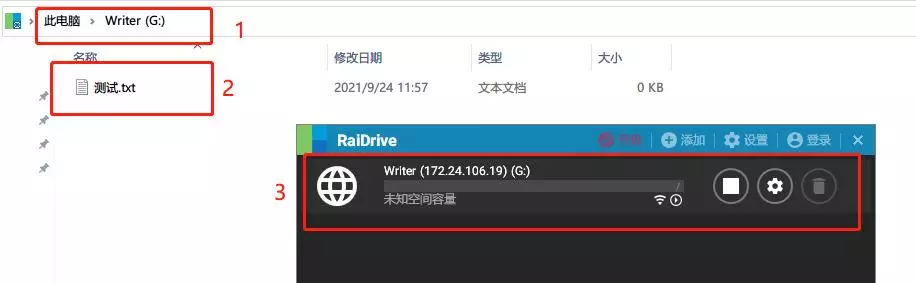

"Link" feature allows you to map app data as a PC directory, so that you can use PC softwafre to edit and manage your data.

This feature is based on general **WebDav** protocol. Most operation systems should support it out of the box, but maybe it is not that easy to use. So here is some easier way to go.

## Windows

On Windows platform we recommand you the third-party software, **RaiDrive**. You can download it by clicking the link below:

[RaiDrive 1.8.0 https://raidrive.en.uptodown.com/windows/download/2114805](https://raidrive.en.uptodown.com/windows/download/2114805)

(1.8.0 version is not the latest, but it has everything we need, and more importantly, it have no ads)

Install and open it, you may see panel like this, just follow the tips:

1. Click "Add" button on the top to enter the configuration.
2. Go "NAS" tab and select the WebDav option
3. Input the dirver name as you like
4. Input the address
    - besides the text "address" you may see the checkbox, just keep it **UNCHECKED** so that we can use http url.
    - Input the IP address and port number, which you can find when you turn on the link feature in the app.
5. Input your customized user name and password if you have any, otherwise just check the "Aonymous" checkbox
6. Click "OK" button to start mapping

If everything goes well, you might see this:

## Linux or MacOS

Wait to be done.