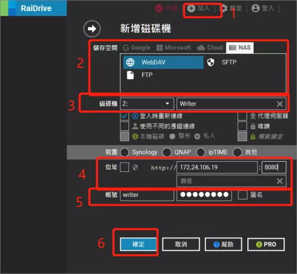

如何使用“連接”功能？

“連接”功能可以將你的應用數據映射為 PC 上的一個資料夾，使得你可以用 PC 的軟件來編輯你的文字。

該功能基於通用的 WebDav 協定實現，你可以使用作業系統自帶的映射邏輯或者任何你熟悉的協力廠商工具來完成映射。以下簡單介紹部分較為簡便的映射管道。

## Windows

在 Windows 平臺這裡推薦使用 RaiDrive 這款協力廠商工具。你可以通過下方的地址來下載安裝包：

[RaiDrive 1.8.0 https://raidrive.en.uptodown.com/windows/download/2114805](https://raidrive.en.uptodown.com/windows/download/2114805)

（1.8.0 並不是最新版，但它功能齊全更重要的是它沒有廣告）

安裝打開後你可以看到如下介面，接著按照下麵步驟操作：

1. 點擊頂部“添加”按鈕進入映射配寘流程
2 .選擇“NAS”並選中“WebDav”協定
3. 選擇映射資料夾的硬碟符和名稱
4. 輸入映射地址
    - 在“地址”字樣的右側你可以看到一個核取方塊，該框是用於切換http和https協定的，**請確保它處於未選中的狀態**，此時協定未 **http**
    - 輸入到右側的地址欄和埠號。截圖中的地址和埠僅供參考，請以啟動應用“連接”功能後介面顯示的為准。
    - “路徑”一欄可以留空
5. 輸入你自定義的用戶名和密碼，如果沒有的話可以勾選“匿名”核取方塊
6. 點擊“確定”按鈕以啟動映射

如果一切順利則在成功後會自動打開映射目錄，如下圖所示：

## Linux 或者 MacOS

待補充